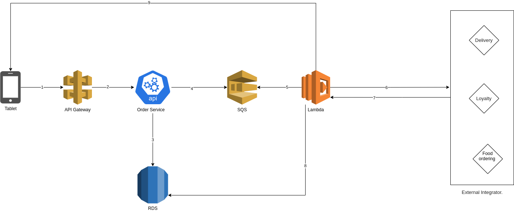

## Requirements
- Python (3.9.5)
- Django (3.12.4)
## Installation
- clone this repository
- run the migration using this command:
```shell
python manage.py migrate
```
note: for tutorial reasons I used Sqlite :)
- start the server using this command:
```shell
python manage.py runserver
```
Then navigate to http://127.0.0.1:8000/
## High Level Architecture

- The frontend (IOS, Android, or Web) send a request to our web service URL
- Ex: api.posrocket.com/api/v1/orders
- The API Gateway receives this request and forwards the request internally to our orders main API
- Note: no one can access the order API except the API gateway.
- When order API receives the request it will do the following:
   - Do the business logic.
   - Save it to the DB.
   - Push the order to SQS.
- Once there is an item in the Queue, the Lambda function will be triggered and do the following:
  - Do the business logic.
  - Send Request to the external integrator.
  - Receive the response from the external integrator.
  - Save it to the DB
  - Send push notification to the frontend to notify the client.
## Lambda - External integrator Communications
  - Lambda will establish the authentication to each integrator.
  - when a request is sent to any integrator it will be like this for ex:
```json
{
  "user": {
    "id": "",
    "phone": "",
    "name": "",
    "email": "",
    "lat": "",
    "lng": ""
  },
  "seller": {
    "id": "",
    "phone": "",
    "name": "",
    "email": "",
    "lat": "",
    "lng": ""
  },
  "order": {
    "id": "",
    "datetime": "",
    "timezone": "",
    "user_note": "",
    "items": [
      {
        "id": "",
        "name": "",
        "quantity": ""
      }
    ]
  }
}
```
- after lambda sent the request we will have 2 scenarios:
  - success: will save the response and notify the user
  - failed: will try 5 times then will mark the event as failed
- in case the integrator have an update regarding the order it will send a request to our **callback** lambda function.

#### note
we have 2 type of lambda functions:
  - main: to send requests to external integrator
  - callback: to receive update form external integrator and notify the client
 
## APIs URL
  - GET/POST http://127.0.0.1:8000/api/v1/orders
  - PATCH/DELETE/GET http://127.0.0.1:8000/api/v1/orders/1
 
## License
MIT
