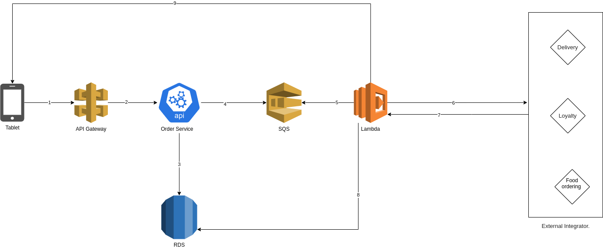

## Requirements
- Python
- Django
- Mysql
## Installation

add here the instaltion steps
- 
- 
- 
-
## Request life cycle

- The frontend (IOS, Android, or Web) send a request to our web service URL
- Ex: api.posrocket.com/api/v1/orders
- The API Gateway receives this request and forwards the request internally to our orders main API
- Note: no one can access the order API except the API gateway.
- When order API receives the request it will do the following:
   - Do the business logic.
   - Save it to the DB.
   - Push the order to SQS.
- Once there is an item in the Queue, the Lambda function will be triggered and do the following:
  - Do the business logic.
  - Send Request to the external integrator.
  - Receive the response from the external integrator.
  - Save it to the DB
  - Send push notification to the frontend to notify the client.
## License
MIT